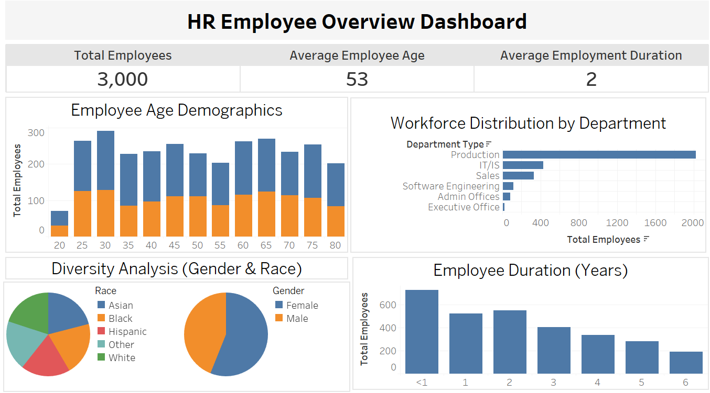

# 📊 Employee Analytics Dashboard (Python & Tableau)

## 📌 Project Overview  
This project analyzes employee data using **Python** for data cleaning and **Tableau** for interactive visualizations.  
It provides insights into **workforce demographics, employment duration, and performance**, helping HR teams make data-driven decisions.  

---

## 🛠️ Technologies Used  
- **Python** (Pandas, NumPy) – Data cleaning & transformation  
- **Tableau Public** – Data visualization & dashboard creation  

---

## 📂 Project Structure

📁 **data/** – Contains raw and cleaned datasets  
- `employee_raw_data.csv` – Original dataset  
- `employee_cleaned_data.csv` – Processed & cleaned data  

📁 **notebooks/** – Jupyter Notebook for data preprocessing  
- `data_cleaning.ipynb` – Python script for data transformation  

📁 **tableau_outputs/** – Tableau project files  
- `hr_employee_analytics.twb` – Tableau workbook with dashboards  

📁 **images/** – Screenshots for documentation  
- `dashboard.png`  

### 1️⃣ **Data Cleaning (Python)** 🐍  
✔ Load and clean raw data  
✔ Handle missing values  
✔ Convert dates & calculate **Age** and **Employment Duration**  
✔ Export cleaned data (`employee_cleaned_data.csv`)  

---

### 2️⃣ **Data Visualization (Tableau)** 📊  
✔ Import cleaned data  
✔ Create **dashboard** with key metrics  
✔ Customize formatting  

---

## 📊 Tableau Dashboards  

### **Employee Overview**  
📌 **KPIs:** Total Employees, Avg. Age, Avg. Employment Duration  
📌 **Chart:** Employee Count by Department, Employee Age Demographics, Gender and Race Breakdown
  

🖼 **Dashboard Preview:**  
  

---
